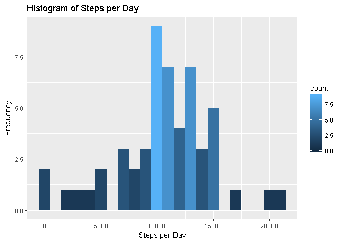
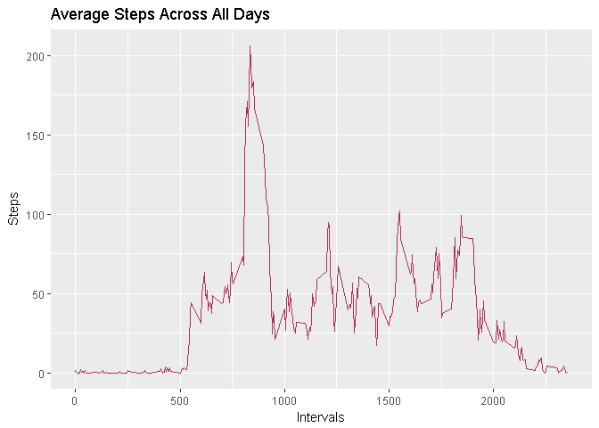
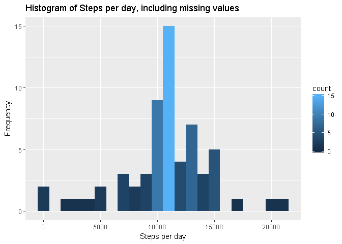
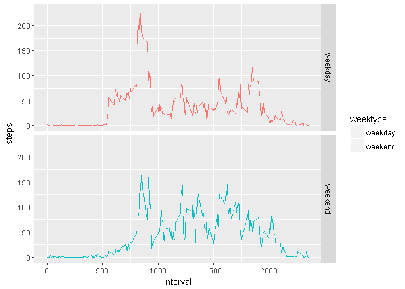

# Reproducible Research: Project 1
M  
December 13, 2016  
This assignment makes use of data from a personal activity monitoring device. This device collects data at 5 minute intervals through out the day. The data consists of two months of data from an anonymous individual collected during the months of October and November, 2012 and include the number of steps taken in 5 minute intervals each day.

The data for this assignment can be downloaded from the course web site.

Download the kintr package from library and set echo=TRUE for the entire R document.

```r
library(knitr)
opts_chunk$set(echo = TRUE)
```
We will assume that you have downloaded the data file and you are now ready to unzip the file.

**Unzip file**

```r
unzip("Factivity.zip")
```
###Loading and processing the data

**Read the file**

```r
data <- read.csv("activity.csv", header = TRUE, sep = ",", colClasses = c("numeric", "character", "integer"))
```

**Change the date into date format using lubridate**

```r
library(lubridate)
```

```
## 
## Attaching package: 'lubridate'
```

```
## The following object is masked from 'package:base':
## 
##     date
```

```r
data$date <- ymd(data$date)
```

**Now check the data using head() and str()**

```r
head(data)
```

```
##   steps       date interval
## 1    NA 2012-10-01        0
## 2    NA 2012-10-01        5
## 3    NA 2012-10-01       10
## 4    NA 2012-10-01       15
## 5    NA 2012-10-01       20
## 6    NA 2012-10-01       25
```

```r
str(data)
```

```
## 'data.frame':	17568 obs. of  3 variables:
##  $ steps   : num  NA NA NA NA NA NA NA NA NA NA ...
##  $ date    : Date, format: "2012-10-01" "2012-10-01" ...
##  $ interval: int  0 5 10 15 20 25 30 35 40 45 ...
```

###What is mean total number of steps taken per day?
1. First, separate out the NA values from data and find the sum of the total number of steps taken per day

```r
library(dplyr)
```

```
## 
## Attaching package: 'dplyr'
```

```
## The following objects are masked from 'package:lubridate':
## 
##     intersect, setdiff, union
```

```
## The following objects are masked from 'package:stats':
## 
##     filter, lag
```

```
## The following objects are masked from 'package:base':
## 
##     intersect, setdiff, setequal, union
```

```r
steps <- data %>%
  filter(!is.na(steps)) %>%
  group_by(date) %>%
  summarize(steps = sum(steps)) %>%
  print
```

```
## # A tibble: 53 × 2
##          date steps
##        <date> <dbl>
## 1  2012-10-02   126
## 2  2012-10-03 11352
## 3  2012-10-04 12116
## 4  2012-10-05 13294
## 5  2012-10-06 15420
## 6  2012-10-07 11015
## 7  2012-10-09 12811
## 8  2012-10-10  9900
## 9  2012-10-11 10304
## 10 2012-10-12 17382
## # ... with 43 more rows
```

2. Use ggplot2 to plot the histogram

```r
library(ggplot2)
ggplot(steps, aes(x =steps)) + geom_histogram(aes(fill = ..count..), binwidth = 1000) + labs(title = "Histogram of Steps per Day", x = "Steps per Day", y = "Frequency")
```

<!-- -->

3. Calculate and print Mean and Median

```r
mean_steps <- mean(steps$steps, na.rm = TRUE)
mean_steps
```

```
## [1] 10766.19
```

```r
median_steps <- median(steps$steps, na.rm = TRUE)
median_steps
```

```
## [1] 10765
```
*The mean total number of steps taken per day is 10766.19*

###What is the average daily activity pattern?
1. First, find the mean steps taken

```r
interval <- data %>%
  filter(!is.na(steps)) %>%
  group_by(interval) %>%
  summarize(steps = mean(steps))
```

2. Now, use ggplot2 for making the time series graph

```r
ggplot(interval, aes(x=interval, y=steps)) + geom_line(color = "maroon") + labs(title = "Average Steps Across All Days", x = "Intervals", y = "Steps")
```

<!-- -->

3. Find max steps across all days

```r
interval[which.max(interval$steps),]
```

```
## # A tibble: 1 × 2
##   interval    steps
##      <int>    <dbl>
## 1      835 206.1698
```

*The interval 835 has the maximum count of steps on average.*

###Imputing missing values
1. Compute total number of missing values

```r
sum(is.na(data$steps))
```

```
## [1] 2304
```
We see that there are 2304 missing values.

2. Fill the missing values with average number of steps taken during that 5-min interval and create a new data set.

```r
new_data <- data
nas <- is.na(new_data$steps)
avg_interval <- tapply(new_data$steps, new_data$interval, mean, na.rm=TRUE, simplify=TRUE)
new_data$steps[nas] <- avg_interval[as.character(new_data$interval[nas])]
```

3. Now test to make sure that there are no more missing values.

```r
sum(is.na(new_data$steps))
```

```
## [1] 0
```

4. Judge the impact of imputing missing values in the new_data

```r
new_steps <- new_data %>%
  filter(!is.na(steps)) %>%
  group_by(date) %>%
  summarize(steps = sum(steps)) %>%
  print
```

```
## # A tibble: 61 × 2
##          date    steps
##        <date>    <dbl>
## 1  2012-10-01 10766.19
## 2  2012-10-02   126.00
## 3  2012-10-03 11352.00
## 4  2012-10-04 12116.00
## 5  2012-10-05 13294.00
## 6  2012-10-06 15420.00
## 7  2012-10-07 11015.00
## 8  2012-10-08 10766.19
## 9  2012-10-09 12811.00
## 10 2012-10-10  9900.00
## # ... with 51 more rows
```

5. Calculate Mean and Median of the new total number of steps data after imputing missing values

```r
mean_new_steps <- mean(new_steps$steps, na.rm = TRUE)
mean_new_steps
```

```
## [1] 10766.19
```

```r
median_new_steps <- median(new_steps$steps, na.rm = TRUE)
median_new_steps
```

```
## [1] 10766.19
```
*We see that after filling in the missing data, the mean and median of the steps taken are same.*

6. Finally, plot a histogram using ggplot2

```r
ggplot(new_steps, aes(x = steps)) +
  geom_histogram(aes(fill = ..count..), binwidth = 1000) +
  labs(title = "Histogram of Steps per day, including missing values", x = "Steps per day", y = "Frequency")
```

<!-- -->

###Are there differences in activity patterns between weekdays and weekends?
1. Create new column, 'weektype'

```r
data1 <- mutate(new_data, weektype = ifelse(weekdays(new_data$date) == "Saturday" | weekdays(new_data$date) == "Sunday", "weekend", "weekday"))
data1$weektype <- as.factor(data1$weektype)
head(data1)
```

```
##       steps       date interval weektype
## 1 1.7169811 2012-10-01        0  weekday
## 2 0.3396226 2012-10-01        5  weekday
## 3 0.1320755 2012-10-01       10  weekday
## 4 0.1509434 2012-10-01       15  weekday
## 5 0.0754717 2012-10-01       20  weekday
## 6 2.0943396 2012-10-01       25  weekday
```

2. Calculate average steps in the 5-min interval for weekday and weekend

```r
new_interval <- data1 %>%
  group_by(interval, weektype) %>%
  summarise(steps = mean(steps))
```

3. Use ggplot to plot panel graph

```r
ggplot(new_interval, aes(x=interval, y=steps, color = weektype)) + geom_line() + facet_grid(weektype~.)
```

<!-- -->


*From the graph above, we can see that there is higher level of activity on the weekends.*


